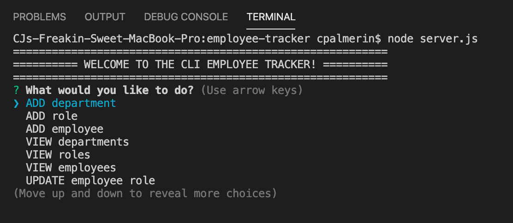
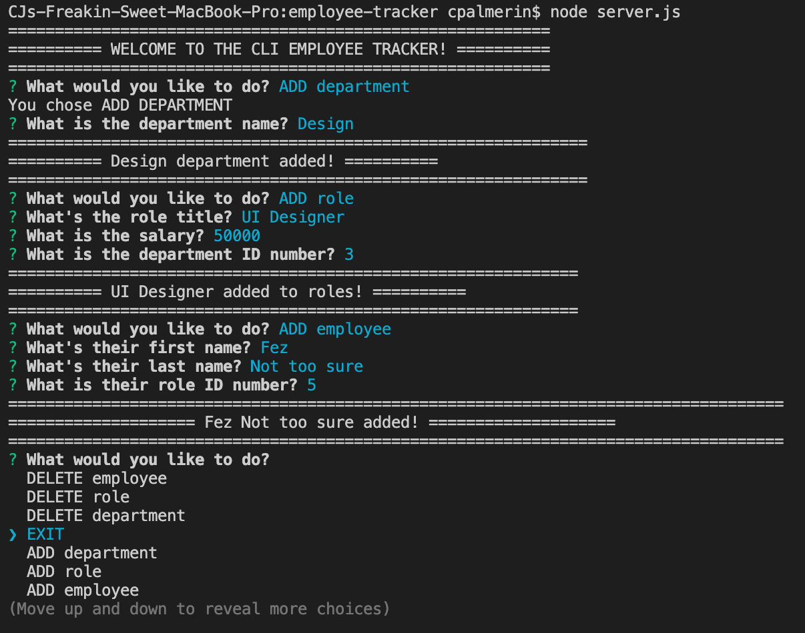
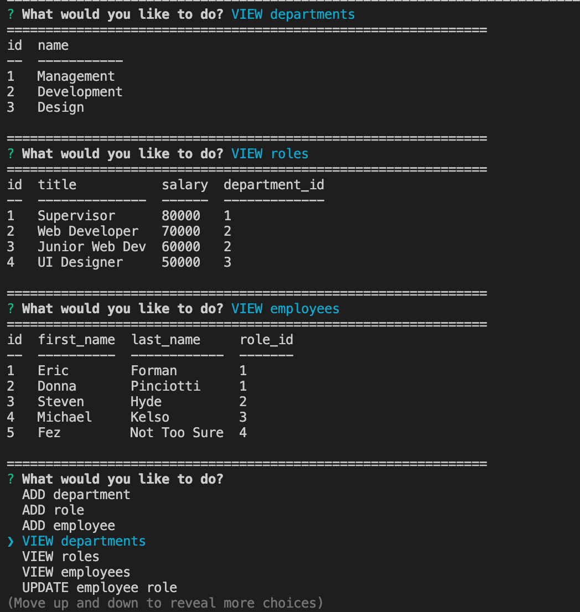

# CLI Employee Tracker

## Description

Keep track of your employees using the CLI Employee Tracker. Add, view, update, and delete all your employees as well as any roles or departments your business may have.

### Table of Contents

[Installation](#installation) | 
[Usage](#usage) | 
[License](#license) | 
[Questions](#questions) | 

### Installation

Install the folder and make sure you have mysql and inquirer installed. Then run the app through the CLI.

### Usage

The CLI Employee Tracker is used in your command line interface. To initiate, run a 'node server.js' command.

### License

### Questions

### cjpalmerin@gmail.com

